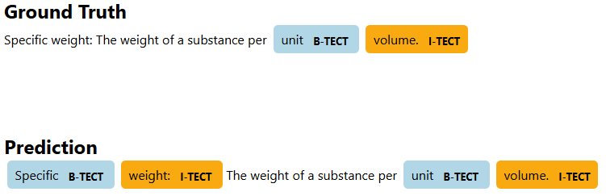
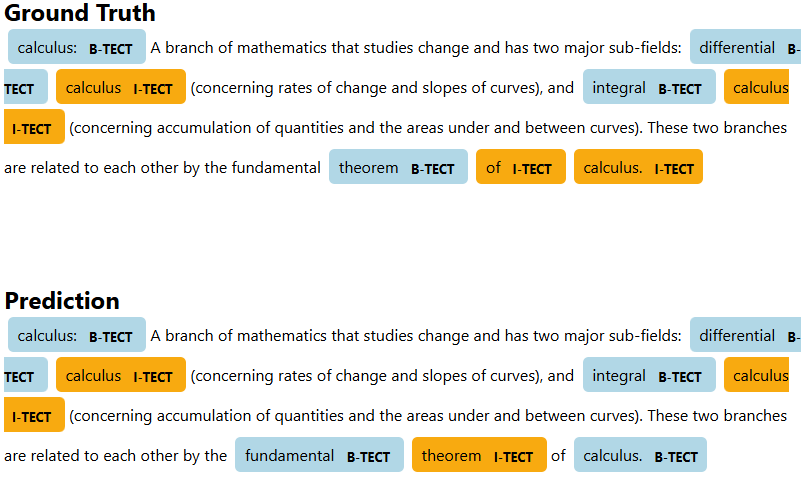
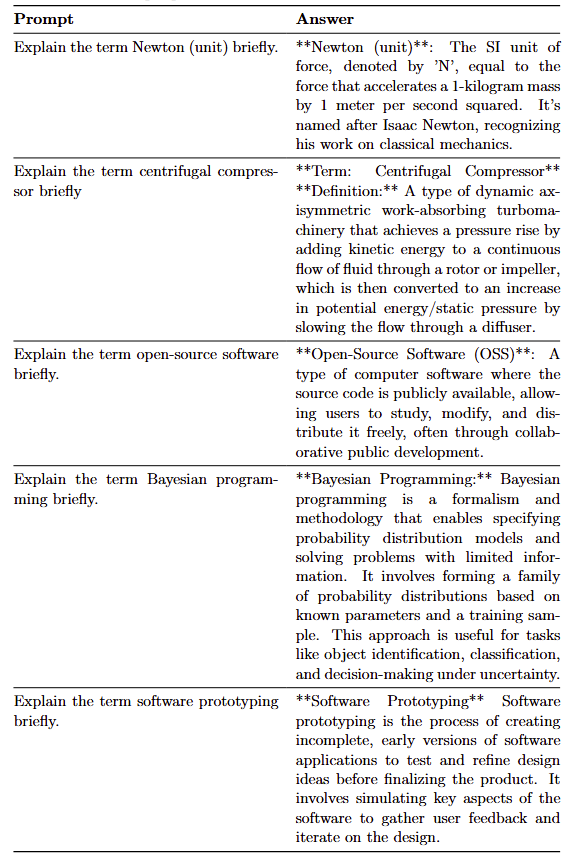

# Deep Learning for Named Entity Recognition and Definition Generation of Technical Terms

This repository contains the implementation and results of my bachelor thesis titled **"Deep Learning for Named Entity Recognition and Definition Generation of Technical Terms."** The goal of this research is to develop a deep learning-based pipeline that identifies named entities from technical texts and generates concise definitions for those entities.

## Objectives

- **Named Entity Recognition (NER):** Implement a model to extract technical terms from specialized texts.
- **Definition Generation:** Develop a system that generates short, accurate definitions for recognized entities through a combination of LLMs and RAG
- **Pipeline Integration:** Provide a complete pipeline for NER and definition generation, suitable for integration with web and backend applications.

## Features

- **NER Model:** Detects and classifies technical terms based on the CONLL-annotated data.
- **Definition Generator:** Generates definitions using a transformer-based language model.
- **Custom Datasets** Two custom datasets were created, one that contains technical terms and their glossary description, scraped from Wikipedia. The other dataset contains ca. 1000 annotatated samples for NER of technical terms.

## Sample Predictions

Here are some sample predictions from the NER and definition generation models:

### Example 1: Named Entity Recognition




### Example 2: Definition Generation


## Repository Structure

```text
├── data                                # Datasets
│   ├── ner_annotations.conll           # CONLL-annotated data for NER
│   └── SciWiGlossaries.csv             # Wikipedia-scraped glossaries
├── definition_generation               # Definition generation models and scripts
│   ├── models                          # Model architectures and related scripts
│   │   ├── base_model.py               # Base model class
│   │   ├── galactica.py                # Galactica model class
│   │   ├── llama.py                    # LLaMA models classes
│   │   ├── mistralai.py                # Mistral AI models classes
│   │   ├── phi.py                      # Phi model class
│   │   └── seq2seq_models.py           # Sequence-to-sequence models classes
│   ├── clean_predictions.ipynb         # Notebook for cleaning predictions
│   ├── finetune_t5.ipynb               # Notebook for fine-tuning T5 model
│   ├── llm_evaluation.py               # Large Language Model evaluation script
│   ├── model_inference.py              # Model inference script
│   └── rag_utils.py                    # Utilities for Retrieval-Augmented Generation
├── example_predictions                 # Directory containing sample predictions
├── technical_term_extraction           # Scripts for technical term extraction
│   ├── fine_tune.py                    # Fine-tuning script for NER
│   ├── hpo.py                          # Hyperparameter optimization script for NER
│   ├── ner_utils.py                    # Utility functions for NER
│   ├── run_inference.py                # Script for running inference
│   └── visualization_utils.py          # Visualization utilities
├── JointModel.py                       # Joint model class
├── README.md                           # Project documentation (this file)
├── requirements.txt                    # Python dependencies
└── visualize.ipynb                     # Notebook for visualizing of dataset/results
```

## Data

The NER model is trained on manually annotated data in the CONLL format, with labels such as `B-TECT` and `I-TECT` to distinguish technical terms.

## Installation

1. Clone the repository:

   ```bash
   git clone https://github.com/amndzdzdz/AI-student-aid
   ```

2. Navigate to the project directory:

   ```bash
   cd thesis-ner-definition
   ```

3. Install dependencies:

   ```bash
   pip install -r requirements.txt
   ```

## Results

The system achieved the following key performance metrics:

- **NER Model:** RoBERTa-Base: Precision: 81%, Recall: 81%, F1-Score: 81%
- **Definition Generator:** Llama 3.1 8b Instruct: ROGUE-L: 0.34, METEOR: 0.41, BERTScore: 0.79

## Possible Improvements

- **Model Choices:** Experiment with additional transformer architectures to improve performance.
- **LLM Fine-Tuning:** Fine-tune LLMs on an instruct dataset with term-definition pairs.
- **Data Increase:** Increase the total amount of NER annotations through additionally labeled
- **Data Augmentation:** Explore automated methods to increase annotated NER data size.

## Contributing

Contributions are welcome! Please fork the repository and submit a pull request. For major changes, open an issue first to discuss your ideas.

## Acknowledgments

- **Advisors:** Prof. Dr. Munir Georges, [Technische Hochschule Ingolstadt]
- **Special Thanks:** Anderson, Boddu, Zubayr, Ghazi, Marcel and Abdullah.